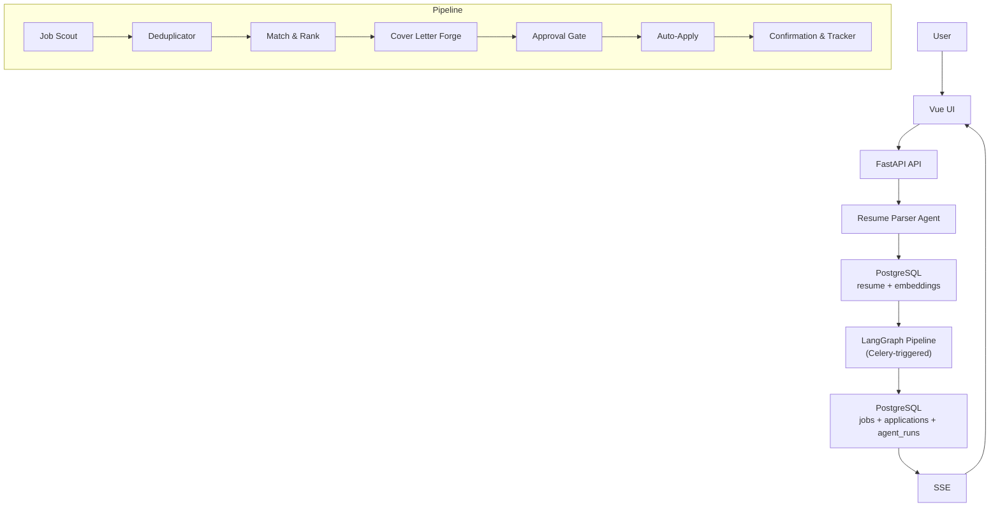

# ApplyIQ

ApplyIQ is an AI-powered autonomous job application engine that helps candidates turn job hunting into a controlled, high-quality workflow instead of a second full-time job. A user uploads a resume once, sets preferences, and ApplyIQ discovers jobs, ranks them with explainable semantic matching, drafts tailored cover letters, pauses for approval, auto-applies where safe, tracks outcomes, and monitors recruiter replies.

This repository is being built as a flagship AI/ML portfolio system. It is designed to demonstrate production-grade thinking across LangGraph orchestration, CrewAI agents, pgvector-based matching, Playwright automation, observability, security, and human-in-the-loop safeguards.

## Core Principles

- No application is submitted without explicit user approval.
- LinkedIn is never scraped directly. Discovery uses Apify, SerpAPI, or future official APIs.
- CAPTCHA always falls back to `manual_required`.
- Resume text and stored credentials are encrypted at rest.
- TDD is the default workflow for backend and frontend work.
- Build, test, and run commands execute inside Docker Compose containers only.

## What ApplyIQ Does

- analyzes a resume into a structured candidate profile
- discovers jobs from multiple sources
- ranks opportunities with explainable matching
- generates tailored cover letters
- supports A/B cover-letter variants before approval
- auto-applies only after approval
- tracks applications and recruiter replies
- surfaces application velocity analytics (response rate, source performance, top-performing titles)
- supports interview-prep workflows for shortlisted roles

## Tech Stack

| Layer | Technology |
|---|---|
| Frontend | Vue 3, Vite, TypeScript, Vue Router, Vuex |
| Backend | FastAPI, Pydantic v2 |
| Database | PostgreSQL 16, pgvector |
| ORM | SQLAlchemy 2.0 async, Alembic |
| Queueing | Celery, Redis |
| Agents | LangGraph, CrewAI |
| LLM | OpenAI GPT-4o |
| Embeddings | OpenAI text-embedding-3-small |
| Automation | Playwright, playwright-stealth |
| Scraping | Apify SDK, SerpAPI, direct scrapers |
| Email Monitoring | Gmail API |
| Encryption | Fernet via `cryptography` |
| Deployment | Railway for backend and workers, Vercel for frontend |

## Architecture Snapshot



The detailed implementation blueprint lives in [PLAN.md](./PLAN.md).

## Current Status

- Phase 1: Foundation and DevOps complete
- Phase 2: Auth and User Management complete
- Phase 3: Resume Pipeline complete
- Phase 4: Job Scraping Engine complete
- Phase 5: Match and Rank Engine complete
- Phase 6: LangGraph Pipeline Orchestration complete
- Phase 7: Cover Letter Generation complete
- Phase 8: Auto-Apply Engine complete
- Phase 9: Gmail Integration and Response Tracking complete
- Phase 10: Polish, Testing, and Production Deployment complete
- Phase 11: Application Velocity Dashboard stretch goal complete
- Phase 12: A/B Cover-Letter Experimentation stretch goal complete

## Getting Started

### Prerequisites

- Docker Desktop
- a `.env` file created from `.env.example`

### Start the stack

```powershell
docker compose up --build
```

Services:

- Frontend: `http://localhost:3000`
- Backend API: `http://localhost:8001`
- Celery worker: runs inside Docker Compose as `worker`
- PostgreSQL: `localhost:5433`
- Redis: `localhost:6380`

### Run migrations

```powershell
docker compose run --rm --build backend alembic upgrade head
```

### Run backend tests

```powershell
docker compose run --rm --build backend python -m pytest tests
```

### Run frontend build verification

```powershell
docker compose run --rm --build frontend npm run build
```

### Build production images

```powershell
docker compose -f docker-compose.yml -f docker-compose.prod.yml build backend
docker compose -f docker-compose.yml -f docker-compose.prod.yml build worker
docker compose -f docker-compose.yml -f docker-compose.prod.yml build beat
docker compose -f docker-compose.yml -f docker-compose.prod.yml build frontend
```

### Health check

```powershell
Invoke-RestMethod http://localhost:8001/health
```

## Environment Setup

Copy `.env.example` to `.env` and populate the required values.

Important variables:

- `DATABASE_URL`
- `REDIS_URL`
- `JWT_SECRET_KEY`
- `FERNET_SECRET_KEY`
- `ENCRYPTION_PEPPER`
- `OPENAI_API_KEY`
- `APIFY_API_TOKEN`
- `SERPAPI_API_KEY`
- `GOOGLE_CLIENT_ID`
- `GOOGLE_CLIENT_SECRET`
- `VITE_API_URL`

## Roadmap

1. Foundation and DevOps
2. Auth and User Management
3. Resume Pipeline
4. Job Scraping Engine
5. Match and Rank Engine
6. LangGraph Pipeline Orchestration
7. Cover Letter Generation
8. Auto-Apply Engine
9. Gmail Integration and Response Tracking
10. Polish, Testing, and Production Deployment
11. Application Velocity Dashboard and analytics
12. A/B Cover-Letter Experimentation and variant selection

## Safety and Compliance

- LinkedIn discovery is ToS-aware and does not use direct scraping.
- The approval gate is mandatory before any automated submission.
- Unsupported or CAPTCHA-blocked flows degrade to manual completion.
- Sensitive data is encrypted and excluded from logs.

## Engineering Standards

- TDD-first workflow
- typed Python and strict TypeScript
- async-first backend architecture
- container-only local execution
- structured logging and auditability
- no shortcuts around security or platform rules

## Demo Placeholders

- Live demo URL: `TBD`
- Product screenshots: `TBD`
- Demo video: `TBD`

## Repository Structure

```text
applyiq/
|- backend/
|- frontend/
|- docker-compose.yml
|- docker-compose.prod.yml
|- .env.example
|- Makefile
|- README.md
`- PLAN.md
```

## Notes

- `README.md` is the project-facing overview.
- `PLAN.md` is the detailed build and architecture blueprint.
- Some current Phase 3 implementation details are interim and will be upgraded later to match the full target architecture.
