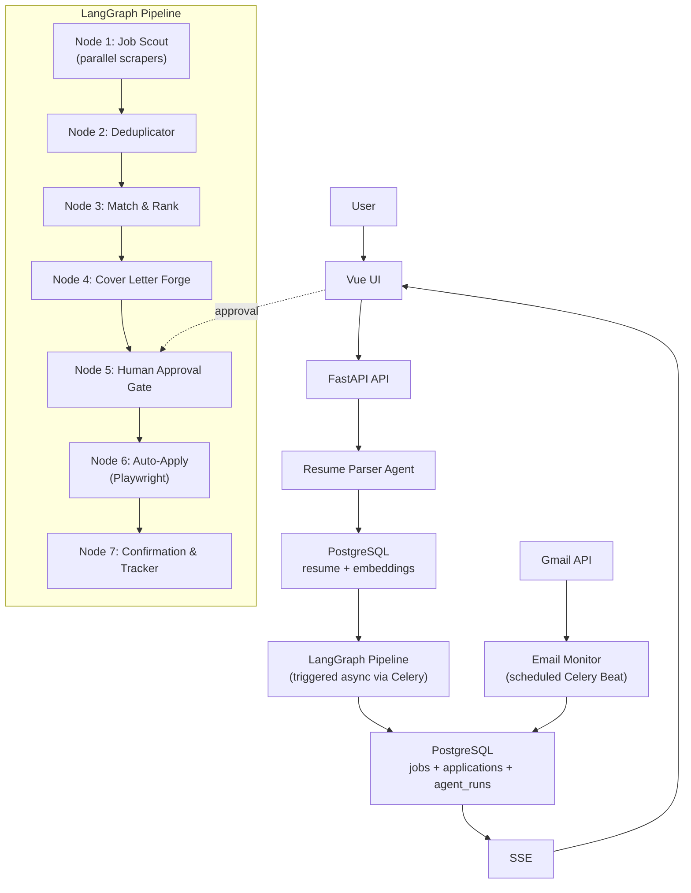

# ApplyIQ

## Phase 0 Plan

ApplyIQ is an AI-powered job application engine for candidates who want a serious, always-on assistant for finding, ranking, tailoring, approving, and tracking job applications without turning job hunting into a second full-time job. A user uploads their resume once, defines their search preferences, and then ApplyIQ continuously discovers relevant roles, scores them with explainable semantic matching, drafts highly specific cover letters, pauses for explicit human approval, auto-applies where safe, tracks outcomes, and monitors recruiter replies. As a flagship AI/ML portfolio project, it demonstrates senior-level engineering across stateful multi-agent orchestration, vector search, browser automation, secure credential handling, and real-time operational visibility.

The core problem ApplyIQ solves is that modern job searching is repetitive, fragmented, and cognitively expensive. Candidates waste hours rewriting the same information, checking multiple job boards, triaging low-quality openings, and manually tracking application outcomes. ApplyIQ turns that process into a controlled, privacy-conscious pipeline with human-in-the-loop approval at the exact moment where automation becomes high risk.

From an AI/ML engineering perspective, this project is impressive because it combines:

- Stateful multi-agent orchestration with LangGraph
- Browser automation with anti-detection safeguards using Playwright stealth
- Multi-source scraping with deduplication and ToS-aware source strategy
- RAG-style semantic matching over resumes and job descriptions with pgvector
- Real-time pipeline visibility with SSE
- An encrypted credential vault for controlled auto-apply workflows

Placeholders:

- Live Demo: `TBD`
- Screenshots: `TBD`
- Architecture Diagram Export: `TBD`

## Non-Negotiable Constraints

### Scraping and Platform Rules

- LinkedIn will not be scraped directly with Playwright or raw requests.
- LinkedIn jobs discovery is limited to Apify's LinkedIn Jobs actor, SerpAPI Google Jobs results, and future official APIs.
- Indeed, Glassdoor, Wellfound, Remotive, and WorkAtAStartup can be scraped with respectful rate limiting, rotating headers, and `robots.txt` awareness.
- Scraping strategy must include 2-5 second request delays, backoff on failure, and source-level fault isolation so one source never blocks a pipeline run.

### Privacy and Data Protection

- Resume text is encrypted at rest and never logged in plaintext.
- Stored site credentials are encrypted in the vault and never persisted or echoed in plaintext.
- Users can delete all data on demand.
- Sensitive agent inputs and outputs are redacted before structured logging.

### Human-in-the-Loop Gates

- No job application is ever submitted without explicit user approval.
- Every pending application must expose the job details, company, cover letter, and match score before approval.
- CAPTCHA detection results in `manual_required`; the system will never attempt bypass.

## Tech Stack

| Layer | Technology | Why This Choice |
|---|---|---|
| Frontend | Vue 3 + Vite + TypeScript + Vue Router + Vuex | Fast SPA iteration, explicit state management, typed routing, and a clean foundation for real-time dashboards |
| Styling | TailwindCSS + custom design system | Fast iteration with enough flexibility to craft a premium, non-template SaaS UI |
| Backend API | FastAPI (Python 3.11+) | Async-native, ideal for SSE, background orchestration, and strict schema validation with Pydantic v2 |
| Database | PostgreSQL 16 + pgvector | Single operational store for relational data plus vector similarity, simplifying joins and ranking |
| ORM | SQLAlchemy 2.0 (async) + Alembic | Strong async support, migrations, typed models, and mature Python ecosystem |
| Job Queue | Celery + Redis | Reliable background execution for scraping, graph runs, email polling, and retries |
| Agent Orchestration | LangGraph | Stateful graph execution with pause/resume, conditional branching, and parallel fan-out |
| Agent Framework | CrewAI | Useful role-based abstraction for specialized agents nested within graph nodes |
| LLM | OpenAI GPT-4o | Strong reasoning and writing quality for resume analysis, matching explanations, and cover letters |
| Embeddings | OpenAI text-embedding-3-small | Cost-effective, reliable embeddings for large-scale semantic matching |
| Browser Automation | Playwright + playwright-stealth | Modern async browser automation with better stealth and stability than Selenium |
| Scraping | Apify SDK + SerpAPI + direct scrapers | Multi-source discovery with a compliant LinkedIn path and flexible fallback coverage |
| Email Monitoring | Gmail API (OAuth2) | Reliable inbox monitoring for recruiter replies without credential scraping |
| Encryption | Fernet (`cryptography`) | Strong symmetric encryption for credential vault and sensitive stored blobs |
| Deployment | Railway (backend + workers) + Vercel or Netlify (frontend) | Portfolio-friendly deployment with low DevOps friction and credible production story |
| Containerisation | Docker + Docker Compose | Consistent local development, worker parity, and deployment portability |
| Auth | Vue Router guards + FastAPI JWT | Clear SPA auth boundaries with explicit API token and refresh-token handling |

## High-Level Architecture



## LangGraph Pipeline Design

### State Schema

```python
from __future__ import annotations

from typing import List, TypedDict


class ApplyIQState(TypedDict):
    user_id: str
    resume: ResumeProfile
    search_preferences: SearchPrefs
    raw_jobs: List[RawJob]
    deduplicated_jobs: List[Job]
    ranked_jobs: List[RankedJob]
    pending_approvals: List[PendingApplication]
    approved_applications: List[Application]
    applied_applications: List[Application]
    errors: List[AgentError]
    current_node: str
```

### Graph Nodes

#### `parse_resume_node`

- Input: `user_id`, resume raw text or stored `resume_profile`
- Output: normalized `ResumeProfile`, updated summary embedding, `current_node`
- Responsibility: use the Resume Intelligence Agent to extract structured profile data and persist canonical resume state
- Error handling: validation failures are written to `state.errors`, pipeline status becomes `failed` only if no valid resume profile exists

#### `fetch_jobs_node`

- Input: `resume`, `search_preferences`
- Output: `raw_jobs`
- Responsibility: fan out to Apify LinkedIn, SerpAPI Google Jobs, Indeed, Wellfound, Remotive, and optional company watchlist scrapers in parallel
- Error handling: each scraper is wrapped independently; one failure appends an `AgentError` and the node returns partial results

#### `dedup_node`

- Input: `raw_jobs`
- Output: `deduplicated_jobs`
- Responsibility: deduplicate by canonicalized `apply_url`, then fuzzy `(title, company)` hashing for near-duplicates across sources
- Error handling: malformed jobs are discarded with structured warnings in `state.errors`

#### `rank_jobs_node`

- Input: `resume`, `deduplicated_jobs`
- Output: `ranked_jobs`
- Responsibility: compute semantic similarity, skills coverage, seniority alignment, location match, and salary alignment
- Error handling: per-job scoring failures are non-fatal and recorded against the job

#### `filter_node`

- Input: `ranked_jobs`, `search_preferences`
- Output: filtered `ranked_jobs`
- Responsibility: enforce hard user preferences before generating cover letters, including remote preference, excluded companies, salary, and location
- Error handling: invalid filters fall back to permissive behavior and log an error

#### `generate_cover_letters_node`

- Input: filtered `ranked_jobs`, `resume`
- Output: `pending_approvals`
- Responsibility: invoke the Cover Letter Forge Agent for shortlisted jobs and persist a draft application row per job
- Error handling: if cover letter generation fails for a job, the system can still surface the job with a regeneration-needed marker

#### `approval_gate_node`

- Input: `pending_approvals`
- Output: paused graph state until resume event
- Responsibility: persist snapshot, mark run `paused_at_gate`, notify frontend, and stop execution pending user review
- Error handling: if state snapshot persistence fails, the graph marks the run `failed` because safe continuation is impossible

#### `auto_apply_node`

- Input: `approved_applications`
- Output: updated `applied_applications`
- Responsibility: detect ATS, retrieve encrypted credentials, run Playwright application flows, upload screenshots, and persist outcomes
- Error handling: failures are isolated per application; unsuccessful jobs are marked `failed` or `manual_required` and execution continues

#### `track_applications_node`

- Input: `applied_applications`
- Output: persisted application records, monitor hooks, completion status
- Responsibility: finalize status history, write observability records, and register downstream email-monitor tracking metadata
- Error handling: tracking failures never erase submission results; only the post-processing step is marked degraded

### Conditional Edges

- After `rank_jobs_node`: if `len(ranked_jobs) == 0`, notify the user that no relevant jobs were found and end the run gracefully.
- After `filter_node`: if no jobs remain after preference filters, mark the run complete with zero pending approvals.
- After `generate_cover_letters_node`: if no drafts are ready, notify the user and end with a degraded-success status.
- After `auto_apply_node`: on a per-application failure, append error details, mark the application accordingly, and continue with the remaining queue.
- `approval_gate_node` resumes only after `POST /api/v1/pipeline/{run_id}/approve` is received with approved application IDs.

### Approval Gate Pause and Resume Strategy

This is the central architectural pattern in ApplyIQ:

1. LangGraph reaches `approval_gate_node`.
2. The node persists a checkpoint payload to Redis keyed by `run_id`, including serialized state, current node, resumable application IDs, and a checksum/version marker.
3. The backend writes a mirrored encrypted `state_snapshot` to `pipeline_runs` for auditability and disaster recovery.
4. The pipeline run is marked `paused_at_gate`.
5. The frontend approval page loads pending applications from PostgreSQL and streams paused-run state over SSE.
6. The user approves, edits, or rejects applications in the UI.
7. The frontend sends `POST /api/v1/pipeline/{run_id}/approve` with selected application IDs and edited cover letters.
8. FastAPI validates ownership, updates `applications.status`, reloads the Redis checkpoint, merges approved application data into the graph state, and enqueues a Celery resume task.
9. The resume task reconstructs the LangGraph executor from the checkpoint and restarts from `auto_apply_node`.
10. Once resume succeeds, the Redis checkpoint is either rotated or deleted to prevent duplicate replays.

Safety rules for resumption:

- Resume requests must be idempotent.
- The checkpoint payload includes a schema version.
- If Redis state is missing, the DB snapshot is used as the fallback recovery path.
- Rejected applications are excluded from resumed state.
- Partial approval is supported; only selected applications continue downstream.

## Agent Definitions

### Agent 1: Resume Intelligence Agent

- Role: Senior Technical Recruiter with 15 years of resume analysis experience
- Goal: Extract a complete, structured professional profile from raw resume text
- Backstory: Has reviewed 50,000+ resumes and understands implicit signals like title seniority, career progression, and context around gaps
- Tooling: `ResumeParserTool`
- Model behavior: strict structured output, schema validation, retry on malformed JSON

Output schema:

```json
{
  "name": "string",
  "email": "string",
  "current_title": "string",
  "years_of_experience": 0,
  "seniority_level": "junior|mid|senior|lead|principal",
  "skills": {
    "technical": [],
    "soft": [],
    "tools": [],
    "languages": []
  },
  "experience": [
    {
      "company": "",
      "title": "",
      "duration_months": 0,
      "highlights": []
    }
  ],
  "education": [
    {
      "degree": "",
      "field": "",
      "institution": "",
      "year": 0
    }
  ],
  "preferred_roles": [],
  "inferred_salary_range": {
    "min": 0,
    "max": 0,
    "currency": "USD"
  },
  "work_style_signals": [],
  "summary_for_matching": "string"
}
```

### Agent 2: Job Scout Agent

- Role: Relentless sourcing specialist who finds hidden opportunities
- Goal: Discover every relevant job opening across supported platforms
- Backstory: Understands mainstream boards, remote-only sources, startup boards, and company career pages
- Tools:
  - `ApifyLinkedInScraper`
  - `SerpAPIJobsSearch`
  - `IndeedDirectScraper`
  - `WellfoundScraper`
  - `RemotiveScraper`
  - `CustomCompanyCareerPageTool`
- Output: `List[RawJob]`

### Agent 3: Match and Rank Agent

- Role: AI-powered candidate-job compatibility expert
- Goal: Score each job with an explainable recommendation
- Backstory: Blends vector similarity with hard constraints and practical recruiter heuristics
- Tools:
  - `EmbeddingMatchTool`
  - `SkillsGapAnalysisTool`
  - `SeniorityAlignmentTool`
- Output per job:

```json
{
  "job_id": "uuid",
  "match_score": 0.87,
  "score_breakdown": {
    "semantic_similarity": 0.91,
    "skills_coverage": 0.82,
    "seniority_alignment": 0.9,
    "location_match": 1.0,
    "salary_alignment": 0.75
  },
  "matched_skills": ["Python", "FastAPI", "PostgreSQL"],
  "missing_skills": ["Kubernetes", "Go"],
  "recommendation": "strong_match|good_match|stretch|skip",
  "one_line_reason": "Excellent technical match; only missing DevOps skills"
}
```

### Agent 4: Cover Letter Forge Agent

- Role: Elite career coach and ghostwriter
- Goal: Write a specific, persuasive, human-sounding cover letter
- Backstory: Optimizes for specificity, company awareness, and authentic tone rather than generic flattery
- Tools:
  - `CompanyResearchTool`
  - `JobDescriptionAnalysisTool`
  - `CandidateHighlightsTool`
- Constraints:
  - Maximum 250 words
  - Must mention the company name
  - Must include one specific thing about the company
  - Must reference a concrete quantified achievement from the candidate profile
  - Must not use banned phrases
  - Must sound personal rather than templated
- Output:

```json
{
  "cover_letter": "string",
  "tone": "formal|conversational",
  "word_count": 0
}
```

### Agent 5: Auto-Apply Agent

- Role: Meticulous form-filling specialist
- Goal: Submit approved job applications safely and accurately
- Backstory: Understands ATS-specific quirks, fallback behavior, and when to stop instead of forcing automation
- Tools:
  - `PlaywrightApplyTool`
  - `ATSDetectorTool`
  - `FormFillerTool`
  - `CustomQuestionAnswerTool`
- Output:

```json
{
  "status": "success|failed|manual_required",
  "confirmation_url": "string|null",
  "confirmation_number": "string|null",
  "screenshot_path": "string",
  "failure_reason": "string|null",
  "manual_required_reason": "string|null"
}
```

### Agent 6: Response Tracker Agent

- Role: Attentive assistant monitoring all communications
- Goal: Detect recruiter replies and update application status automatically
- Backstory: Watches for relevant messages, classifies them, and reduces manual tracking overhead
- Tools:
  - `GmailSearchTool`
  - `EmailClassifierTool`
  - `ApplicationStatusUpdaterTool`
- Schedule: Celery Beat every 4 hours
- Behavior: trigger user-facing notifications when application state changes

## Browser Automation Architecture

### `PlaywrightApplyTool` Design

- Uses `playwright-stealth` to minimize obvious automation fingerprints.
- Randomizes viewport, user agent, navigation pacing, typing cadence, and mouse movement patterns within safe bounds.
- Launches each application in an isolated browser context so cookies and session artifacts do not leak between submissions.
- Captures screenshots before and after each major step and stores them in cloud storage for an audit trail.
- Retrieves credentials from the encrypted vault only at execution time and redacts them from all logs and telemetry.
- Applies a timeout strategy of 30 seconds per action with 3 retries and exponential backoff before falling back to `manual_required`.
- Runs only inside Celery workers, never in the FastAPI request path.

### ATS Support Matrix

| ATS | Auto-Apply Support | Notes |
|---|---|---|
| Greenhouse | Full | High-priority launch support because of prevalence in tech hiring |
| Lever | Full | Straightforward launch target with consistent form structure |
| Workday | Partial | Some variants too complex for reliable full automation |
| SmartRecruiters | Full | Good structured flow for automation |
| LinkedIn Easy Apply | Full | Only for approved browser-authenticated flows, never direct scraping |
| Indeed Apply | Full | Supported via dedicated form strategy |
| iCIMS | Partial | CAPTCHA frequency makes graceful fallback important |
| Taleo (Oracle) | Manual Required | Too hostile and brittle for defensible launch support |
| Company Direct Form | Best-effort | Dynamic form parsing with strong fallback rules |

### CAPTCHA Handling Strategy

- Detect CAPTCHA indicators via known selectors, scripts, and challenge frames.
- Immediately mark the application `manual_required` if detected.
- Notify the user with the exact URL and preserve the partially prepared state when possible.
- Never use CAPTCHA-solving services because that creates ToS, ethics, and security risk.

## Database Schema

### `users`

- `id` UUID primary key
- `email` text unique
- `hashed_password` text
- `full_name` text
- `created_at` timestamp
- `last_login` timestamp
- `is_active` boolean
- `subscription_tier` enum: `free|pro`

### `resume_profiles`

- `id` UUID primary key
- `user_id` UUID foreign key to `users`
- `raw_text` text, encrypted
- `parsed_profile` JSONB
- `resume_embedding` vector(1536)
- `file_url` text
- `file_hash` text
- `created_at` timestamp
- `updated_at` timestamp

### `search_preferences`

- `id` UUID primary key
- `user_id` UUID foreign key to `users`
- `target_roles` text array
- `preferred_locations` text array
- `remote_preference` enum: `onsite|hybrid|remote|any`
- `salary_min` integer
- `salary_max` integer
- `currency` text
- `excluded_companies` text array
- `seniority_level` enum
- `is_active` boolean

### `jobs`

- `id` UUID primary key
- `external_id` text
- `source` enum: `linkedin|indeed|wellfound|remotive|direct|other`
- `title` text
- `company_name` text
- `company_domain` text
- `location` text
- `is_remote` boolean
- `salary_min` integer
- `salary_max` integer
- `description_text` text
- `description_embedding` vector(1536)
- `apply_url` text unique
- `posted_at` timestamp
- `scraped_at` timestamp
- `is_active` boolean

### `job_matches`

- `id` UUID primary key
- `user_id` UUID foreign key to `users`
- `job_id` UUID foreign key to `jobs`
- `match_score` float
- `score_breakdown` JSONB
- `matched_skills` text array
- `missing_skills` text array
- `recommendation` enum
- `created_at` timestamp

### `applications`

- `id` UUID primary key
- `user_id` UUID foreign key to `users`
- `job_id` UUID foreign key to `jobs`
- `pipeline_run_id` UUID foreign key to `pipeline_runs`
- `status` enum: `pending_approval|approved|applying|applied|failed|manual_required|interview_requested|rejected|offer|withdrawn`
- `cover_letter_text` text
- `cover_letter_version` integer
- `approved_at` timestamp
- `applied_at` timestamp
- `confirmation_url` text
- `confirmation_number` text
- `screenshot_urls` text array
- `failure_reason` text
- `notes` text
- `created_at` timestamp
- `updated_at` timestamp

### `pipeline_runs`

- `id` UUID primary key
- `user_id` UUID foreign key to `users`
- `status` enum: `pending|running|paused_at_gate|complete|failed`
- `state_snapshot` JSONB, encrypted
- `jobs_found` integer
- `jobs_matched` integer
- `applications_submitted` integer
- `started_at` timestamp
- `completed_at` timestamp
- `celery_task_id` text

### `agent_runs`

- `id` UUID primary key
- `pipeline_run_id` UUID foreign key to `pipeline_runs`
- `agent_name` text
- `node_name` text
- `input_summary` text
- `output_summary` text
- `full_output` JSONB
- `tokens_used` integer
- `latency_ms` integer
- `status` enum: `success|error`
- `error_message` text
- `created_at` timestamp

### `email_monitors`

- `id` UUID primary key
- `user_id` UUID foreign key to `users`
- `application_id` UUID foreign key to `applications`
- `gmail_thread_id` text
- `last_checked_at` timestamp
- `latest_classification` enum
- `is_resolved` boolean

### `credential_vault`

- `id` UUID primary key
- `user_id` UUID foreign key to `users`
- `site_name` text
- `site_url` text
- `encrypted_username` text
- `encrypted_password` text
- `created_at` timestamp
- `last_used_at` timestamp

Encryption note:

- Vault secrets are encrypted with Fernet using a server-side peppered key derivation strategy so a database leak alone is insufficient to recover credentials.

## API Endpoints

All endpoints return a consistent envelope:

```json
{
  "success": true,
  "data": {},
  "error": null
}
```

### Auth

| Method | Path | Auth | Request Body | Success Response |
|---|---|---|---|---|
| POST | `/api/v1/auth/register` | Public | `RegisterRequest { email, password, full_name }` | `AuthResponse { user, access_token, refresh_token }` |
| POST | `/api/v1/auth/login` | Public | `LoginRequest { email, password }` | `AuthResponse { user, access_token, refresh_token }` |
| POST | `/api/v1/auth/refresh` | Refresh token cookie or body token | `RefreshTokenRequest { refresh_token? }` | `TokenRefreshResponse { access_token, expires_in }` |
| DELETE | `/api/v1/auth/account` | Authenticated | `DeleteAccountRequest { password_confirmation }` | `DeleteAccountResponse { deleted: true, purge_job_id }` |

### Resume

| Method | Path | Auth | Request Body | Success Response |
|---|---|---|---|---|
| POST | `/api/v1/resume/upload` | Authenticated | `multipart/form-data` with `file` and optional `replace_existing` | `ResumeUploadResponse { resume_profile_id, parse_status, parsed_profile, embedding_status }` |
| GET | `/api/v1/resume` | Authenticated | None | `ResumeProfileResponse { profile, preferences, updated_at }` |
| PUT | `/api/v1/resume/preferences` | Authenticated | `UpdateSearchPreferencesRequest { target_roles, preferred_locations, remote_preference, salary_min, salary_max, currency, excluded_companies, seniority_level }` | `SearchPreferencesResponse { preferences }` |
| GET | `/api/v1/resume/profile-completeness` | Authenticated | None | `ProfileCompletenessResponse { score, missing_fields, recommendations }` |

### Jobs

| Method | Path | Auth | Request Body | Success Response |
|---|---|---|---|---|
| GET | `/api/v1/jobs` | Authenticated | Query params: `page`, `page_size`, `source`, `recommendation`, `min_score`, `status` | `PaginatedJobsResponse { items, page, page_size, total }` |
| GET | `/api/v1/jobs/{id}` | Authenticated | None | `JobDetailResponse { job, match, company_info, application_state }` |
| POST | `/api/v1/jobs/{id}/ignore` | Authenticated | `IgnoreJobRequest { reason? }` | `JobActionResponse { job_id, state: "ignored" }` |
| POST | `/api/v1/jobs/{id}/save` | Authenticated | `SaveJobRequest { note? }` | `JobActionResponse { job_id, state: "saved" }` |
| GET | `/api/v1/jobs/semantic-search` | Authenticated | Query params: `q`, `limit`, `min_score` | `SemanticSearchResponse { query, items }` |

### Pipeline

| Method | Path | Auth | Request Body | Success Response |
|---|---|---|---|---|
| POST | `/api/v1/pipeline/start` | Authenticated | `StartPipelineRequest { search_preferences_override?, target_company_urls?, max_jobs?, dry_run? }` | `PipelineStartResponse { run_id, status, celery_task_id }` |
| GET | `/api/v1/pipeline/{run_id}/status` | Authenticated | None, SSE stream | `text/event-stream` with `PipelineStatusEvent { run_id, node, status, counters, timestamp }` |
| GET | `/api/v1/pipeline/{run_id}/results` | Authenticated | None | `PipelineResultsResponse { run, summary, approvals, applications, errors }` |
| POST | `/api/v1/pipeline/{run_id}/approve` | Authenticated | `ApproveApplicationsRequest { application_ids, bulk_threshold?, notes? }` | `PipelineResumeResponse { run_id, resumed: true, approved_count }` |
| POST | `/api/v1/pipeline/{run_id}/reject` | Authenticated | `RejectApplicationsRequest { application_ids, reason? }` | `PipelineRejectResponse { run_id, rejected_count }` |
| PUT | `/api/v1/pipeline/{run_id}/application/{app_id}/cover-letter` | Authenticated | `UpdateCoverLetterRequest { cover_letter_text, tone? }` | `CoverLetterUpdateResponse { application_id, cover_letter_version, cover_letter_text }` |

### Applications

| Method | Path | Auth | Request Body | Success Response |
|---|---|---|---|---|
| GET | `/api/v1/applications` | Authenticated | Query params: `status`, `source`, `page`, `page_size`, `date_from`, `date_to`, `min_score` | `PaginatedApplicationsResponse { items, page, page_size, total }` |
| GET | `/api/v1/applications/{id}` | Authenticated | None | `ApplicationDetailResponse { application, job, match, screenshots, agent_runs, timeline, email_thread? }` |
| POST | `/api/v1/applications/{id}/withdraw` | Authenticated | `WithdrawApplicationRequest { reason }` | `ApplicationActionResponse { application_id, status: "withdrawn" }` |
| PUT | `/api/v1/applications/{id}/status` | Authenticated | `UpdateApplicationStatusRequest { status, note? }` | `ApplicationStatusResponse { application_id, status, updated_at }` |
| GET | `/api/v1/applications/stats` | Authenticated | Query params: `range`, `source?`, `group_by?` | `ApplicationStatsResponse { totals, response_rate, by_source, by_status, trend }` |

### Vault

| Method | Path | Auth | Request Body | Success Response |
|---|---|---|---|---|
| POST | `/api/v1/vault/credentials` | Authenticated | `StoreCredentialRequest { site_name, site_url, username, password }` | `VaultCredentialResponse { id, site_name, site_url, username_masked, created_at }` |
| GET | `/api/v1/vault/credentials` | Authenticated | None | `VaultCredentialListResponse { items: [{ id, site_name, site_url, username_masked, last_used_at }] }` |
| DELETE | `/api/v1/vault/credentials/{id}` | Authenticated | None | `VaultDeleteResponse { id, deleted: true }` |

### Notifications

| Method | Path | Auth | Request Body | Success Response |
|---|---|---|---|---|
| GET | `/api/v1/notifications` | Authenticated | None, SSE stream | `text/event-stream` with `NotificationEvent { type, title, body, entity_id, created_at }` |

## Frontend Pages and Components

### `/`

- Purpose: landing page that sells the product quickly
- Key content: hero, animated demo, feature highlights, CTA

### `/dashboard`

- Purpose: operational command center
- Components:
  - stats row
  - active pipeline card
  - recent activity feed
  - quick actions

### `/resume`

- Purpose: resume upload and profile configuration hub
- Components:
  - upload dropzone
  - parsed profile display
  - completeness score
  - preferences form
  - embedding summary preview

### `/pipeline`

- Purpose: live orchestration view
- Components:
  - animated LangGraph visualization
  - per-node state indicators
  - live job counters
  - transition into approval gate

### `/pipeline/[run_id]/approve`

- Purpose: human approval gate for pending applications
- Components:
  - split job and cover letter view
  - match score breakdown
  - inline editor
  - approve, edit, reject controls
  - bulk approve above threshold
  - review progress tracker

### `/applications`

- Purpose: personal ATS and lifecycle tracker
- Components:
  - Kanban board
  - filter toolbar
  - application cards
  - detail drawer

### `/applications/[id]`

- Purpose: detailed application forensics and prep
- Components:
  - job description
  - company info
  - scoring breakdown
  - cover letter history
  - agent logs
  - screenshots
  - timeline
  - email preview
  - interview prep action

### `/vault`

- Purpose: secure credential management
- Components:
  - credential cards
  - add credential form
  - encryption explainer
  - last used timestamps

### `/settings`

- Purpose: account and privacy management
- Components:
  - notification preferences
  - Gmail OAuth controls
  - data export
  - delete account
  - subscription info

## Phased Execution Plan

### Phase 1: Foundation and DevOps

- Initialize monorepo layout under `backend/` and `frontend/`
- Create Docker Compose stack for FastAPI, PostgreSQL 16 with pgvector, and Redis
- Set up Alembic migrations
- Define environment variable management with `.env.example`
- Establish FastAPI baseline structure with routers, middleware, CORS, and exception handling
- Add `/health` endpoint returning dependency health
- Configure structured logging with `structlog`

Checkpoint:

- `docker compose up` succeeds
- database migrations run cleanly
- Redis is reachable
- `/health` returns HTTP 200 with healthy dependency status

### Phase 2: Auth and User Management

- Implement `users` and `credential_vault` models
- Add password hashing with `passlib`
- Implement JWT auth with access and refresh tokens
- Add reusable auth dependencies in FastAPI
- Build Fernet encryption service for the vault
- Add register, login, refresh, and delete-account endpoints
- Integrate Vue Router auth guards and authenticated API client flows on the frontend

Checkpoint:

- register works
- login works
- protected API routes require auth
- refresh flow issues new access token
- delete-account flow purges user data

### Phase 3: Resume Pipeline

- Implement `resume_profiles` and `search_preferences`
- Add PDF and DOCX extraction using `PyMuPDF` and `python-docx`
- Build Resume Intelligence Agent with strict schema validation
- Generate and store resume embeddings in pgvector
- Add HNSW indexes
- Implement upload and preference APIs
- Build resume management UI

Checkpoint:

- upload a real resume
- extract and store raw text securely
- persist parsed JSON profile
- store embedding in pgvector
- show profile and preferences in the UI

### Phase 4: Job Scraping Engine

- Build async scraper classes for Apify LinkedIn, SerpAPI Google Jobs, Indeed, Wellfound, and Remotive
- Add optional company career page scraping
- Implement deduplication by URL and fuzzy title plus company matching
- Embed job descriptions
- Wrap scraping in Celery tasks
- Add development scrape trigger endpoint

Checkpoint:

- scrape from at least 3 sources
- persist 50 or more jobs
- deduplicate successfully
- store embeddings for ranked search

### Phase 5: Match and Rank Engine

- Implement vector similarity queries with pgvector
- Build Match and Rank Agent with score breakdown output
- Add skills gap analysis
- Add seniority alignment scoring
- Add salary and preference filtering
- Build semantic search endpoint and jobs UI

Checkpoint:

- rank at least 50 jobs
- top 10 matches are meaningfully relevant
- semantic search returns sensible results
- filters work correctly

### Phase 6: LangGraph Pipeline Orchestration

- Implement the `ApplyIQState` schema
- Build all graph nodes and edges
- Add async parallel scraping fan-out
- Wrap the graph in Celery execution
- Persist `pipeline_runs`
- Stream node progress through SSE
- Implement pause and resume through Redis checkpointing
- Build the live pipeline UI and approval gate transition

Checkpoint:

- start a pipeline run
- watch live status updates
- reach the approval gate
- approve selected applications
- resume from checkpoint into auto-apply flow

### Phase 7: Cover Letter Generation

- Build Cover Letter Forge Agent
- Add company research and job description analysis tools
- Enforce banned phrases, specificity checks, and word limits
- Store versioned cover letters per application
- Add inline editing and regenerate actions in the approval UI

Checkpoint:

- generate 5 distinct cover letters
- each is company-specific
- each is under 250 words
- each contains at least one quantified candidate highlight

### Phase 8: Auto-Apply Engine

- Set up Playwright with stealth
- Build ATS detection and per-ATS strategies
- Implement form filling and custom question answering
- Add screenshot capture to cloud storage
- Integrate credential vault reads
- Detect CAPTCHA and force `manual_required`
- Push status updates to DB and frontend

Checkpoint:

- complete at least 3 test submissions on supported ATS flows
- capture screenshots
- persist confirmation metadata
- degrade gracefully to `manual_required` when needed

### Phase 9: Gmail Integration and Response Tracking

- Set up Gmail OAuth2
- Build email polling, classification, and status updates
- Add Celery Beat schedule every 4 hours
- Surface notifications through SSE and the application detail page

Checkpoint:

- process a test recruiter email
- classify it correctly
- update application status
- notify the user in the UI

### Phase 10: Polish, Testing, and Production Deployment

- Add unit, integration, and end-to-end tests
- Tune vector indexes and caching
- Perform security review and OWASP pass
- Improve loading, empty, and error states
- Build production containers
- Deploy backend, worker, beat, and frontend
- Add Sentry and final observability pass

Checkpoint:

- full test suite passes
- production deployment works end to end
- live demo URL is available
- core pipeline works in production

## Folder Structure

```text
applyiq/
├── backend/
│   ├── app/
│   │   ├── api/
│   │   │   └── v1/
│   │   │       ├── routes/
│   │   │       │   ├── auth.py
│   │   │       │   ├── resume.py
│   │   │       │   ├── jobs.py
│   │   │       │   ├── pipeline.py
│   │   │       │   ├── applications.py
│   │   │       │   ├── vault.py
│   │   │       │   └── notifications.py
│   │   │       └── deps.py
│   │   ├── agents/
│   │   │   ├── resume_intelligence/
│   │   │   │   ├── agent.py
│   │   │   │   └── tools.py
│   │   │   ├── job_scout/
│   │   │   │   ├── agent.py
│   │   │   │   └── tools.py
│   │   │   ├── match_rank/
│   │   │   │   ├── agent.py
│   │   │   │   └── tools.py
│   │   │   ├── cover_letter/
│   │   │   │   ├── agent.py
│   │   │   │   └── tools.py
│   │   │   ├── auto_apply/
│   │   │   │   ├── agent.py
│   │   │   │   ├── tools.py
│   │   │   │   ├── ats/
│   │   │   │   │   ├── greenhouse.py
│   │   │   │   │   ├── lever.py
│   │   │   │   │   ├── workday.py
│   │   │   │   │   └── base.py
│   │   │   │   └── stealth.py
│   │   │   └── response_tracker/
│   │   │       ├── agent.py
│   │   │       └── tools.py
│   │   ├── pipeline/
│   │   │   ├── graph.py
│   │   │   ├── nodes.py
│   │   │   ├── state.py
│   │   │   └── checkpointer.py
│   │   ├── scrapers/
│   │   │   ├── apify_linkedin.py
│   │   │   ├── serpapi_jobs.py
│   │   │   ├── indeed.py
│   │   │   ├── wellfound.py
│   │   │   ├── remotive.py
│   │   │   ├── deduplicator.py
│   │   │   └── base.py
│   │   ├── models/
│   │   ├── schemas/
│   │   ├── services/
│   │   │   ├── embedding_service.py
│   │   │   ├── encryption_service.py
│   │   │   ├── gmail_service.py
│   │   │   └── storage_service.py
│   │   ├── tasks/
│   │   │   ├── pipeline_task.py
│   │   │   ├── scrape_task.py
│   │   │   └── email_monitor_task.py
│   │   ├── core/
│   │   │   ├── config.py
│   │   │   ├── database.py
│   │   │   ├── redis.py
│   │   │   ├── security.py
│   │   │   └── logging.py
│   │   └── main.py
│   ├── alembic/
│   ├── tests/
│   │   ├── unit/
│   │   ├── integration/
│   │   └── e2e/
│   ├── Dockerfile
│   ├── Dockerfile.worker
│   └── requirements.txt
├── frontend/
│   ├── src/
│   │   ├── assets/
│   │   ├── components/
│   │   │   ├── ui/
│   │   │   ├── pipeline/
│   │   │   │   ├── PipelineGraph.vue
│   │   │   │   ├── NodeStatus.vue
│   │   │   │   └── ApprovalGate.vue
│   │   │   ├── applications/
│   │   │   │   ├── KanbanBoard.vue
│   │   │   │   ├── ApplicationCard.vue
│   │   │   │   └── ApplicationDetail.vue
│   │   │   ├── resume/
│   │   │   │   ├── ResumeUpload.vue
│   │   │   │   ├── ProfileDisplay.vue
│   │   │   │   └── PreferencesForm.vue
│   │   │   ├── jobs/
│   │   │   │   ├── JobsTable.vue
│   │   │   │   ├── MatchScoreCard.vue
│   │   │   │   └── SemanticSearch.vue
│   │   │   └── dashboard/
│   │   │       ├── StatsRow.vue
│   │   │       └── ActivityFeed.vue
│   │   ├── router/
│   │   │   └── index.ts
│   │   ├── store/
│   │   │   ├── index.ts
│   │   │   └── modules/
│   │   │       ├── auth.ts
│   │   │       ├── pipeline.ts
│   │   │       └── applications.ts
│   │   ├── views/
│   │   │   ├── auth/
│   │   │   │   ├── LoginView.vue
│   │   │   │   └── RegisterView.vue
│   │   │   ├── DashboardView.vue
│   │   │   ├── ResumeView.vue
│   │   │   ├── PipelineView.vue
│   │   │   ├── PipelineApprovalView.vue
│   │   │   ├── JobsView.vue
│   │   │   ├── ApplicationsView.vue
│   │   │   ├── ApplicationDetailView.vue
│   │   │   ├── VaultView.vue
│   │   │   └── SettingsView.vue
│   │   ├── services/
│   │   │   ├── api.ts
│   │   │   ├── sse.ts
│   │   │   └── auth.ts
│   │   ├── composables/
│   │   │   ├── usePipelineSSE.ts
│   │   │   └── useNotifications.ts
│   │   ├── types/
│   │   ├── App.vue
│   │   ├── main.ts
│   │   └── styles.css
│   ├── index.html
│   ├── vite.config.ts
│   ├── tsconfig.json
│   └── Dockerfile
├── docker-compose.yml
├── docker-compose.prod.yml
├── .env.example
├── Makefile
└── README.md
```

## Environment Variables

```bash
# OpenAI
OPENAI_API_KEY=
OPENAI_EMBEDDING_MODEL=text-embedding-3-small
OPENAI_CHAT_MODEL=gpt-4o

# Database
DATABASE_URL=postgresql+asyncpg://applyiq:password@db:5432/applyiq
PGVECTOR_ENABLED=true

# Redis
REDIS_URL=redis://redis:6379/0

# Auth
JWT_SECRET_KEY=
JWT_ALGORITHM=HS256
ACCESS_TOKEN_EXPIRE_MINUTES=15
REFRESH_TOKEN_EXPIRE_DAYS=7

# Encryption
FERNET_SECRET_KEY=
ENCRYPTION_PEPPER=

# Scraping APIs
APIFY_API_TOKEN=
SERPAPI_API_KEY=

# Google
GOOGLE_CLIENT_ID=
GOOGLE_CLIENT_SECRET=
GOOGLE_REDIRECT_URI=

# Storage
R2_ACCOUNT_ID=
R2_ACCESS_KEY_ID=
R2_SECRET_ACCESS_KEY=
R2_BUCKET_NAME=applyiq-screenshots
R2_PUBLIC_URL=

# Email
RESEND_API_KEY=
FROM_EMAIL=noreply@applyiq.app

# Celery
CELERY_BROKER_URL=redis://redis:6379/1
CELERY_RESULT_BACKEND=redis://redis:6379/2

# Frontend
VITE_API_URL=http://localhost:8000
VITE_APP_NAME=ApplyIQ

# Sentry
SENTRY_DSN_BACKEND=
SENTRY_DSN_FRONTEND=

# Feature Flags
ENABLE_AUTO_APPLY=true
MAX_AUTO_APPLY_PER_RUN=20
```

## Key Engineering Decisions

- LangGraph over plain Celery chains because the workflow requires conditional branching, parallel fan-out, and a hard pause/resume approval gate in the middle of execution.
- pgvector over Pinecone because the system benefits from keeping job metadata and embedding similarity in one database query path.
- Fernet over a third-party secrets manager because it is secure enough for this scope, auditable, and avoids unnecessary platform complexity in a portfolio build.
- Playwright over Selenium because it is faster, async-friendly, and better suited to modern browser automation with isolation and stealth.
- Celery Beat over Gmail webhooks because polling is simpler to implement and good enough for a four-hour monitoring cadence.
- Approval gate before auto-apply with no exceptions because ethical automation and candidate safety matter more than maximizing blind throughput.
- `manual_required` instead of CAPTCHA bypass because CAPTCHA solving is brittle, ethically questionable, and likely to violate platform rules.
- Generated TypeScript types from FastAPI OpenAPI because eliminating type drift makes the full-stack architecture feel intentionally engineered rather than improvised.

## Demo Script

1. Open the dashboard and show headline metrics.
2. Open the resume page and show parsed profile, inferred seniority, and salary range.
3. Start a fresh pipeline run from the pipeline page.
4. Watch the LangGraph visualization as scraper nodes run in parallel.
5. Reach the approval gate and inspect matched jobs plus generated cover letters.
6. Approve a handful of applications and resume the pipeline.
7. Open an application detail page and show Playwright screenshots plus confirmation metadata.
8. Show a tracked recruiter reply classified as `interview_requested`.
9. Open `agent_runs` data to demonstrate observability and token accounting.
10. End on the live deployment URL and summarize the production architecture.

## Stretch Goals

- Fine-tune a smaller model on user-provided historical writing samples for tone adaptation
- Ship a browser extension that lets users add any job posting into the pipeline
- Add salary intelligence against market benchmarks
- Add a bias detector for problematic job-description language
- Visualize recruiter and company network relationships
- Run A/B cover letter experiments and compare response rates
- Support multiple candidate profiles for different role families
- Add an application velocity analytics dashboard

## Global Engineering Standards

### Code Quality

- Follow TDD for backend and frontend feature work: write the failing test first, implement the smallest viable change, then refactor with the test suite green.
- Python uses `from __future__ import annotations`, full typing, and Pydantic v2 schemas.
- TypeScript runs with `strict: true`, no `any`, and no ignore directives.
- Async functions must handle exceptions intentionally.
- Constants live in shared constants modules, not inline magic values.
- API responses use the standard envelope shape.
- Agent outputs are validated before entering graph state.

### Security

- Never log secrets, raw resume text, cover letters, or email content.
- Use SQLAlchemy ORM patterns exclusively for data access.
- Restrict CORS origins in production.
- Apply rate limits with `slowapi`.
- Validate file uploads by MIME type and size and reject suspicious content.
- Verify vault decryption fails without the server-side pepper.

### Async Architecture

- Database work uses `AsyncSession`.
- Playwright runs only in workers.
- SSE uses async-safe queueing.
- LangGraph nodes are `async def` to preserve concurrency.

### Git Discipline

- Commit format follows `feat(phase-N): description`, `fix(agent): description`, or `test(scraper): description`.
- Ignore secrets, build artifacts, screenshots, cached browsers, and local-only outputs.
- Tag each completed phase.
- Use phase-specific branches.

### Error Handling

- Agent failures are logged and appended to `state.errors` rather than crashing the whole pipeline.
- Scraper failures never stop other sources from completing.
- Auto-apply failures are isolated per application.
- Frontend route segments use Error Boundaries and never expose raw stack traces.

### UI Standards

- The experience should feel like a premium SaaS product, not a tutorial clone.
- The pipeline visualization is the visual centerpiece.
- The approval gate is the highest-priority workflow surface.
- Prefer skeleton states over generic spinners.
- The application tracker supports drag-and-drop.
- Match score is rendered visually, not just numerically.
- Timestamps render in the user's local timezone.
